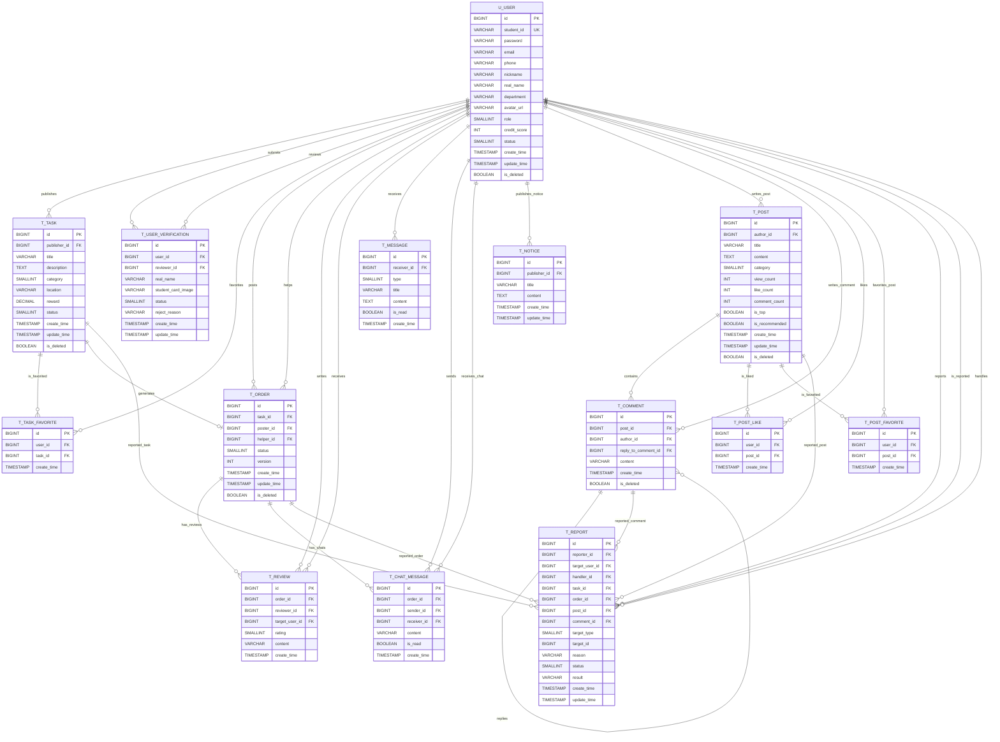

# CampusHub E-R 图 Mermaid 版

```mermaid
erDiagram
    U_USER {
        BIGINT id PK
        VARCHAR student_id UK
        VARCHAR password
        VARCHAR email
        VARCHAR phone
        VARCHAR nickname
        VARCHAR real_name
        VARCHAR department
        VARCHAR avatar_url
        SMALLINT role
        INT credit_score
        SMALLINT status
        TIMESTAMP create_time
        TIMESTAMP update_time
        BOOLEAN is_deleted
    }

    T_USER_VERIFICATION {
        BIGINT id PK
        BIGINT user_id FK
        BIGINT reviewer_id FK
        VARCHAR real_name
        VARCHAR student_card_image
        SMALLINT status
        VARCHAR reject_reason
        TIMESTAMP create_time
        TIMESTAMP update_time
    }

    T_TASK {
        BIGINT id PK
        BIGINT publisher_id FK
        VARCHAR title
        TEXT description
        SMALLINT category
        VARCHAR location
        DECIMAL reward
        SMALLINT status
        TIMESTAMP create_time
        TIMESTAMP update_time
        BOOLEAN is_deleted
    }

    T_TASK_FAVORITE {
        BIGINT id PK
        BIGINT user_id FK
        BIGINT task_id FK
        TIMESTAMP create_time
    }

    T_ORDER {
        BIGINT id PK
        BIGINT task_id FK
        BIGINT poster_id FK
        BIGINT helper_id FK
        SMALLINT status
        INT version
        TIMESTAMP create_time
        TIMESTAMP update_time
        BOOLEAN is_deleted
    }

    T_REVIEW {
        BIGINT id PK
        BIGINT order_id FK
        BIGINT reviewer_id FK
        BIGINT target_user_id FK
        SMALLINT rating
        VARCHAR content
        TIMESTAMP create_time
    }

    T_MESSAGE {
        BIGINT id PK
        BIGINT receiver_id FK
        SMALLINT type
        VARCHAR title
        TEXT content
        BOOLEAN is_read
        TIMESTAMP create_time
    }

    T_CHAT_MESSAGE {
        BIGINT id PK
        BIGINT order_id FK
        BIGINT sender_id FK
        BIGINT receiver_id FK
        VARCHAR content
        BOOLEAN is_read
        TIMESTAMP create_time
    }

    T_NOTICE {
        BIGINT id PK
        BIGINT publisher_id FK
        VARCHAR title
        TEXT content
        TIMESTAMP create_time
        TIMESTAMP update_time
    }

    T_POST {
        BIGINT id PK
        BIGINT author_id FK
        VARCHAR title
        TEXT content
        SMALLINT category
        INT view_count
        INT like_count
        INT comment_count
        BOOLEAN is_top
        BOOLEAN is_recommended
        TIMESTAMP create_time
        TIMESTAMP update_time
        BOOLEAN is_deleted
    }

    T_COMMENT {
        BIGINT id PK
        BIGINT post_id FK
        BIGINT author_id FK
        BIGINT reply_to_comment_id FK
        VARCHAR content
        TIMESTAMP create_time
        BOOLEAN is_deleted
    }

    T_POST_LIKE {
        BIGINT id PK
        BIGINT user_id FK
        BIGINT post_id FK
        TIMESTAMP create_time
    }

    T_POST_FAVORITE {
        BIGINT id PK
        BIGINT user_id FK
        BIGINT post_id FK
        TIMESTAMP create_time
    }

    T_REPORT {
        BIGINT id PK
        BIGINT reporter_id FK
        BIGINT target_user_id FK
        BIGINT handler_id FK
        BIGINT task_id FK
        BIGINT order_id FK
        BIGINT post_id FK
        BIGINT comment_id FK
        SMALLINT target_type
        BIGINT target_id
        VARCHAR reason
        SMALLINT status
        VARCHAR result
        TIMESTAMP create_time
        TIMESTAMP update_time
    }

    U_USER ||--o{ T_TASK : publishes
    U_USER ||--o{ T_USER_VERIFICATION : submits
    U_USER ||--o{ T_USER_VERIFICATION : reviews

    U_USER ||--o{ T_TASK_FAVORITE : favorites
    T_TASK ||--o{ T_TASK_FAVORITE : is_favorited

    T_TASK ||--o| T_ORDER : generates
    U_USER ||--o{ T_ORDER : posts
    U_USER ||--o{ T_ORDER : helps

    T_ORDER ||--o{ T_REVIEW : has_reviews
    U_USER ||--o{ T_REVIEW : writes
    U_USER ||--o{ T_REVIEW : receives

    U_USER ||--o{ T_MESSAGE : receives
    T_ORDER ||--o{ T_CHAT_MESSAGE : has_chats
    U_USER ||--o{ T_CHAT_MESSAGE : sends
    U_USER ||--o{ T_CHAT_MESSAGE : receives_chat
    U_USER ||--o{ T_NOTICE : publishes_notice

    U_USER ||--o{ T_POST : writes_post
    T_POST ||--o{ T_COMMENT : contains
    U_USER ||--o{ T_COMMENT : writes_comment
    T_COMMENT ||--o{ T_COMMENT : replies

    U_USER ||--o{ T_POST_LIKE : likes
    T_POST ||--o{ T_POST_LIKE : is_liked
    U_USER ||--o{ T_POST_FAVORITE : favorites_post
    T_POST ||--o{ T_POST_FAVORITE : is_favorited

    U_USER ||--o{ T_REPORT : reports
    U_USER ||--o{ T_REPORT : is_reported
    U_USER ||--o{ T_REPORT : handles
    T_TASK ||--o{ T_REPORT : reported_task
    T_ORDER ||--o{ T_REPORT : reported_order
    T_POST ||--o{ T_REPORT : reported_post
    T_COMMENT ||--o{ T_REPORT : reported_comment
```

